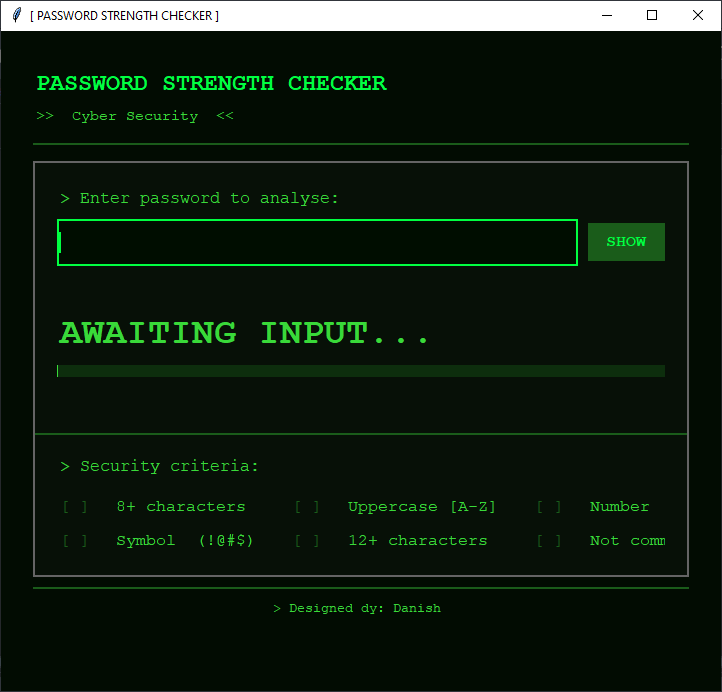
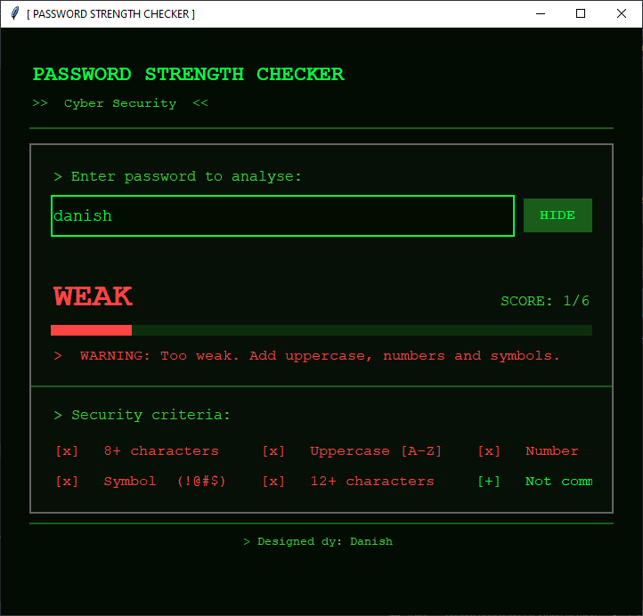
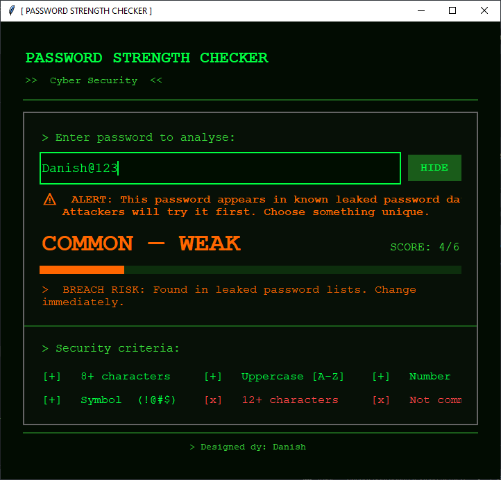
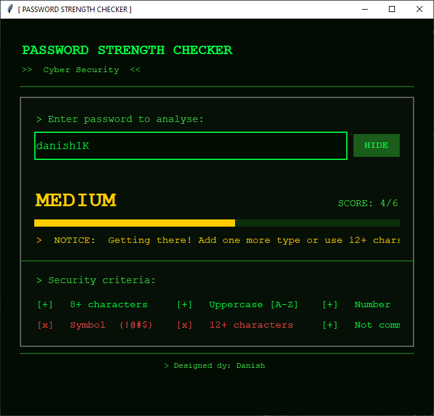
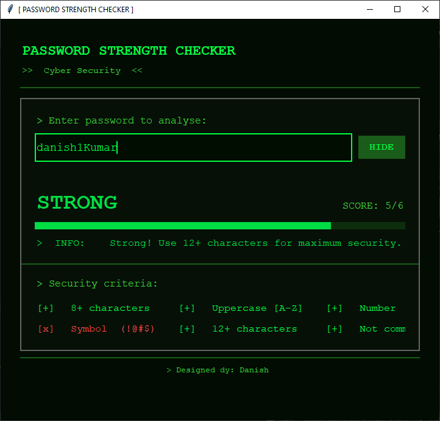
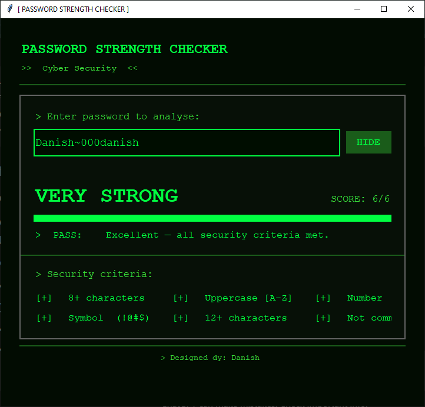

# 🔐 Password Strength Checker

A modern Cyber Security themed Password Strength Checker built with Python and Tkinter.

The application analyzes passwords in real-time and provides strength ratings based on multiple security criteria.

---

## 🚀 Features

* Real-time password analysis
* Strength levels:

  * Weak
  * Common
  * Medium
  * Strong
  * Very Strong
* Detects common/leaked password patterns
* Password visibility toggle (Show/Hide)
* Security score calculation
* Dynamic strength progress bar
* Cyber Security inspired UI design
* Instant security recommendations

---

## 📋 Security Criteria

The password is evaluated using the following checks:

* ✅ Minimum 8 characters
* ✅ Contains uppercase letters
* ✅ Contains numbers
* ✅ Contains symbols
* ✅ 12+ characters bonus
* ✅ Not a common/leaked password pattern

---

## 🛠️ Technologies Used

* Python
* Tkinter
* Regular Expressions (re)

---

## 📸 Screenshots

### Main Interface



### Weak Password Detection



### Common Password Detection



### Medium Password Detection



### Strong Password Detection



### Very Strong Password Detection



---

## ▶️ How to Run

1. Clone the repository

```bash
git clone https://github.com/daniishkumar/PasswordStrengthChecker.git
```

2. Navigate into the project folder

```bash
cd PasswordStrengthChecker
```

3. Run the application

```bash
python Password_Strength_Checker.py
```

---

## 📂 Project Structure

```text
PasswordStrengthChecker/
│
├── Password_Strength_Checker.py
├── README.md
├── screenshots/
   ├── home.png
   ├── weak.png
   ├── medium.png
   └── strong.png

```

---

## 👨‍💻 Author

Danish

Cyber Security Enthusiast

