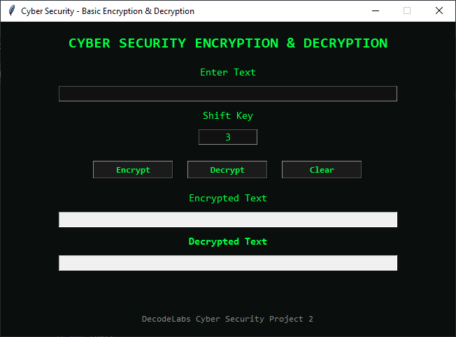
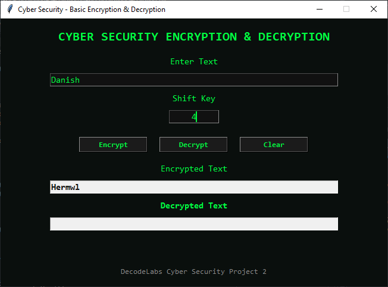
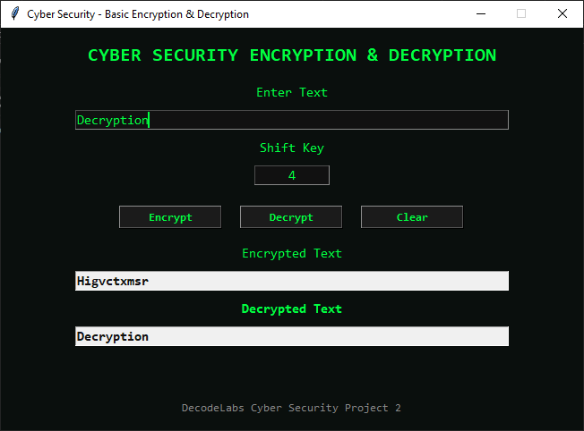

# decodelabs_tasks

A collection of cybersecurity-focused Python applications developed using Python and Tkinter.

These projects demonstrate practical implementations of password security, encryption, decryption, and secure software development concepts through interactive graphical user interfaces.

---

# 📂 Projects Included

## 🔐 Password Strength Checker

A modern GUI-based password security analyzer that evaluates password strength in real-time based on multiple security criteria.

### Features

* Real-time password analysis
* Password strength meter
* Security score calculation
* Common password detection
* Password visibility toggle
* Instant security recommendations
* Cybersecurity-themed interface

### Screenshots

#### Main Interface


The primary dashboard where users can enter passwords and receive instant security feedback.

---

#### Weak Password Detection


Demonstrates detection of weak passwords that are vulnerable to brute-force and dictionary attacks.

---

#### Common Password Detection


Demonstrates the detection of commonly used or leaked passwords that are frequently targeted in dictionary and credential-stuffing attacks, warning users to choose a more secure and unique password.

--- 

#### Medium Password Detection


Shows a partially secure password that satisfies some security requirements while suggesting improvements.

---

#### Strong Password Detection


Displays a strong password that meets most security criteria and achieves a high security score.

---

#### Very Strong Password Detection


Illustrates a highly secure password that fulfills all security requirements, including length, complexity, uniqueness, uppercase letters, numbers, and special characters

---

## 🔒 Basic Encryption & Decryption

A Python Tkinter application that demonstrates text encryption and decryption using the Caesar Cipher algorithm.

### Features

* Text encryption
* Text decryption
* Custom shift key support
* User-friendly graphical interface
* Cybersecurity-themed design
* Error handling and validation

### Screenshots

#### Main Interface



The main application window where users enter text and configure encryption settings.

---

#### Encryption Process



Shows plaintext being transformed into encrypted ciphertext using the Caesar Cipher algorithm.

---

#### Decryption Process



Demonstrates successful recovery of the original message from encrypted text.

---

# 🛠 Technologies Used

* Python
* Tkinter
* Regular Expressions
* Caesar Cipher Algorithm
* GUI Development
* Cybersecurity Fundamentals

---

# 📁 Repository Structure

```text
Cybersecurity-Python-Projects/
│
├── README.md
│
├── Password-Strength-Checker/
│   ├── Password_Strength_Checker.py
│   ├── screenshots/
│   ├── demo/
│   └── README.md
│
└── Basic-Encryption-Decryption/
    ├── BasicEncryptionDecryption.py
    ├── screenshots/
    └── README.md
```

# ▶️ Running the Projects

Clone the repository:

```bash
git clone https://github.com/daniishkumar/decodelabs_tasks.git
```

Navigate to the repository:

```bash
cd decodelabs_tasks
```

Run Password Strength Checker:

```bash
python Password-Strength-Checker/Password_Strength_Checker.py
```

Run Basic Encryption & Decryption:

```bash
python Basic-Encryption-Decryption/BasicEncryptionDecryption.py
```

---

# 🎯 Learning Objectives

These projects were developed to practice:

* Password Security Analysis
* Encryption Fundamentals
* GUI Application Development
* Secure Coding Practices
* Python Programming
* Cybersecurity Concepts

---

# 👨‍💻 Author

**Danish**

Cyber Security Enthusiast | Python Developer

---

⭐ If you found these projects useful, consider giving the repository a star.
